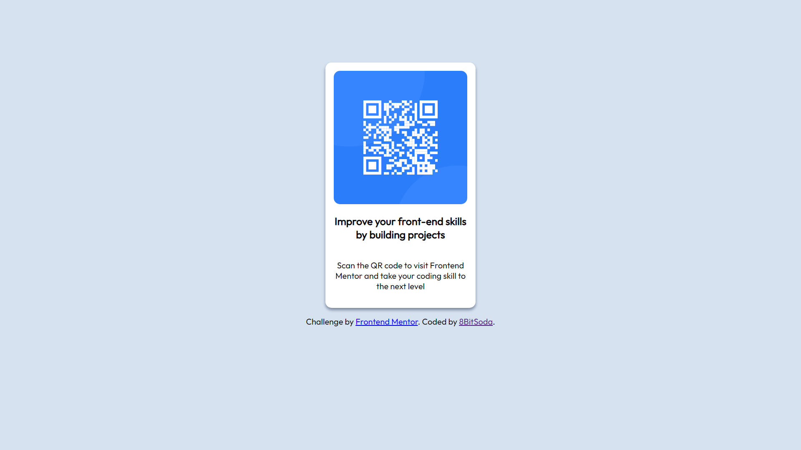

# Frontend Mentor - QR code component solution

This is a solution to the [QR code component challenge on Frontend Mentor](https://www.frontendmentor.io/challenges/qr-code-component-iux_sIO_H). Frontend Mentor challenges help you improve your coding skills by building realistic projects.

## Table of contents

- [Overview](#overview)
  - [Screenshot](#screenshot)
- [My process](#my-process)
  - [Built with](#built-with)
  - [What I learned](#what-i-learned)
  - [Continued development](#continued-development)
  - [Useful resources](#useful-resources)
- [Author](#author)

**Note: Delete this note and update the table of contents based on what sections you keep.**

## Overview

### Screenshot

- Source Code in [Github](https://github.com/8BitSoda/FM-01-QR-Code-Component)

## My process

### Built with

- Vanilla Javascript
- CSS Stylesheets
- Google Fonts - Outfit

**Note: These are just examples. Delete this note and replace the list above with your own choices**

### What I learned

This is my first project returning to HTML and CSS to get experience in app development with these languages*.

By far the most important thing I learned was reading off imported code, rather than code that I've already built. A skill required for team projects and collaborations to easily understand and build on projects.

And CSS.

### Continued development

CSS in particular is a pain to get right, by far the biggest roadblock to making this project, structuring itself could use some work, optimizations could be made and less boilerplate.

Moreover, my process of coding is extremely flawed and unstructured, picking off at random parts, instead of building the base then the design.

### Useful resources

- [W3schools](https://www.w3schools.com/) and various SO Pages - Helped me get back on track with CSS

## Author

- Github - [Bazel](https://github.com/8BitSoda)
- Frontend Mentor - [8BitSoda](https://www.frontendmentor.io/profile/8BitSoda)